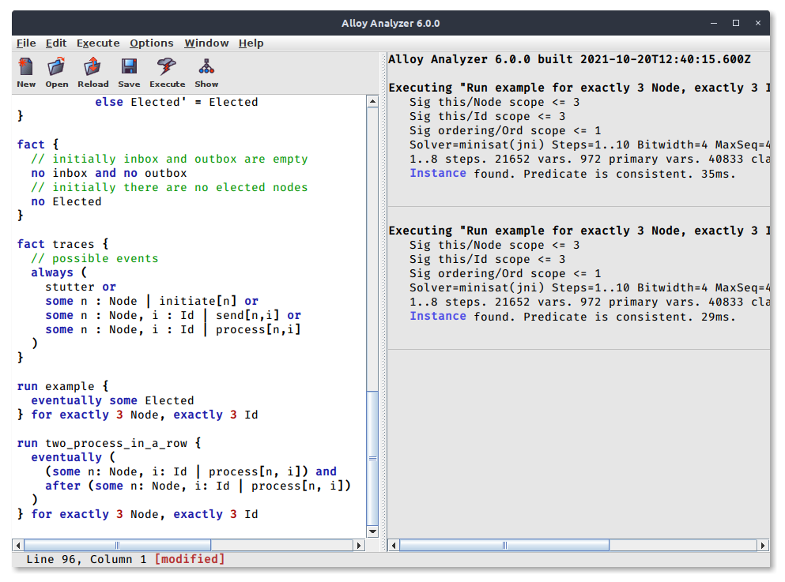
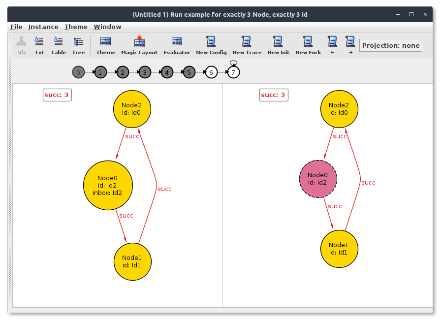

# Alloy 6

Alloy 6 is a new *major* version. It features new keywords and symbols that allow to specify and assess *behavioral* models natively (rather than by modeling traces explicitly as in previous versions). It also features new solving techniques as well as an upgraded Visualizer. 




## Mutable signatures and fields

Alloy 6 extends previous versions of Alloy with a `var` keyword to specify that a signature or field is *mutable*. A signature or field *not* preceded by `var` is said to be *static* and assumed to be constant over time.

## Value of an expression in the next state

The value of an expression `e` in the next state is denoted by `e'` (`e` followed by a quote). In addition to constructs from relational logic, constraints are also extended with *linear-time temporal logic with past* connectives, which allow to reason about future and past states along a trace (the meaning of connectives is given below). 

## Instances are traces

Instances are now *traces*, that is *infinite* sequences of states, where a state is a valuation for signatures and fields. The considered traces are represented as *lasso* traces: that is, finite sequences featuring a loop from the last state back to a former state. Because the last state can be looped back to itself, this is completely general. The Visualizer shows a depiction of the currently-displayed lasso trace, between the toolbar and the visualization pane (see below).

> An instance for a model that does not feature variable signatures or fields can be thought of as a trace made of a single state with a loop to itself. In such a case, notice the Visualizer works exactly as in older versions of Alloy.

The valuation of a mutable signature or field is likely to vary from state to state in a given trace, while *static* (that is, immutable) ones remain unchanged in a given trace. Due to the possible presence of toplevel mutable signatures, the keywords `univ` and `iden` no longer represent constants and should themselves be considered mutable values. On the other hand, the interpretation of a plain old Alloy model (provided it does not use any Alloy 6 syntactic construct) collapses to the usual Alloy semantics.

## Time horizon

Analyses proceed as in Alloy by bounding signatures. In addition to placing bounds on sets assigned to type signatures, the scope specification may constrain the _time horizon_, that is the possible number of transitions of _lasso_ traces to explore (recall that traces _are_ infinite but periodic, which allows to _represent_ them as _finite_ lasso traces). To do so, Alloy features a reserved `steps` keyword to be used like type signature names in plain scopes (`steps` cannot be used anywhere else):

+ If the time horizon takes the form `for M .. N steps`, only lasso traces with at least `M` transitions and at most `N` ones (*including the looping transition* starting in the last state)  will be explored (this is called *bounded model checking*).
+ If the time horizon takes the form `for N steps`, this is equivalent to `for 1 .. N steps`
+ If no time horizon is given, this is implicitly equivalent to `for 10 steps`.
+ If the time horizon takes the form `for 1.. steps` then the time horizon will be unbounded (in that case, the selected solver must support *complete* model checking). Remark that, from the theoretical point of view, the analysis is guaranted to terminate; but in practice, it may be very long or fail due to unavailable memory. Such an option should therefore preferably be executed to check assertions on small models and only when checking with a bounded time horizon does not find counterexamples anymore.

## Complete model-checking

As discussed just above, Alloy 6 now offers the possibility to perform *complete* model-checking, that is model-checking over all possible traces, without bounding them upfront. This is possible because the state space is finite thanks to scopes on signatures. Complete model-checking is theoretically guaranteed to terminate, but may fail due to lack of memory or may run for too long. To perform complete model-checking, the user must install a specific model-checker. Currently, NuSMV and nuXmv are supported (notice that they can also be used for bounded model checking). 

## Meaning of temporal connectives

A future-time temporal formula takes this form:

```
expr ::= unOp expr | expr binOp expr 
unOp ::= always | eventually | after
binOp ::= until | releases | ;
```

Every such operator is interpreted in a given state of an instance (trace). To give a precise semantics, we consider the trace to be indexed by non-negative integers, starting at state 0. Then, the meaning of these operators is as follows:

+ The expression `after F` is true in state _i_ iff `F` is true in state _i + 1_.
+ The expression `always F` is true in state _i_ iff `F` is true in every state ≥ _i_.
+ The expression `eventually F` is true in state _i_ iff `F` is true in some state ≥ _i_.
+ The expression `F until G` is true in state _i_ iff `G` is true in some state _j_ >= _i_ and `F` is true in every state _k_ such that _i_ ≤ _k_ < _j_.
+ The expression `F releases G` is true in state _i_ iff `G` is true in every state ≥ _i_ up to and including a state _k_ in which `F` is true, or there is no such _k_ in which case `G` holds in any state >= _i_.
+ The expression `F ; G` is true in state _i_ iff `F` is true in state _i_ and `G` is true in state _i + 1_.

The (right-associative) `;` operator is useful to describe sequences of operations, to describe a scenario passed to a run command for instance. Indeed, supposing `p`, `q`, `r` and `s` are predicates representing operations, a run command specifying that they are played in sequence could be written: 

```alloy
run { p and after (q and after (r and after s)) }
```

or 

```alloy
run { 
	p
	after q
	after after r
	after after after s
}
```

With `;`, one can simply write:

```alloy
run { p; q; r; s }
```


A past-time temporal formula takes this form:

```
expr ::= unOp expr | expr binOp expr 
unOp ::= before | historically | once
binOp ::= since | triggered
```
The meaning of these operators is as follows:

+ The expression `before F` is true in state _i > 0_ iff `F` is true in state _i - 1_. By convention, `before F` is false in state 0.
+ The expression `historically F` is true in state _i_ iff `F` is true in every state ≤ _i_.
+ The expression `once F` is true in state _i_ iff `F` is true in some state ≤ _i_.
+ The expression `F since G` is true in state _i_ iff `G` is true in some state _j_ ≤ _i_ and `F` is true in every state _k_ such that _j_ < _k_ ≤ _i_.
+ The expression `F triggered G` is true in state _i_ iff `F` is true in some state _j_ ≤ _i_ and `G` is true in every state _j_ < _k_ ≤ _i_, or `F` if false in every state ≤ _i_ in which case `G` is true in every state ≤ _i_.

## Extended Visualizer

Alloy 6 also features a Visualizer enhanced to display traces in a user-friendly way. The visualization pane shows variable fields and signatures with dashed lines. It is split into two contiguous panes which show two consecutive states. The lasso trace depicted above the two states shows where you are in the trace by coloring the states in white. Finally, the Visualizer features a sophisticated way to explore alternative instances of a specification:


* `New config` yields a trace where the configuration (that is, the valuation of *static* parts) changed
* `New trace` yields a new trace under the same configuration
* `New init` yields a trace with a different initial state, under the same configuration
* `New fork` yields a new trace which is similar to the current one until the currently-displayed state but differs afterwards. 



## Compatibility with pre-6 models

Alloy 6 uses new symbols (exactly two: the single quote `'` and the semicolon `;`) and several new keywords (as well as ones reserved for possible future extensions) listed below in alphabetical order:
```
after always before enabled event eventually historically invariant modifies once releases since steps triggered until var
```
Alloy 6 is compatible with old models as long as they don't use these symbols or keywords. 

On the other hand, if an old model of yours uses single quotes or some of these keywords (as identifiers), then you will have to replace them to ensure that Alloy 6 interprets your model as before (for instance changing `var` into `var_` or `variable` or `foo`). Notice the single quote can for instance be replaced with the double quote symbol `"` (which is legal Alloy).
