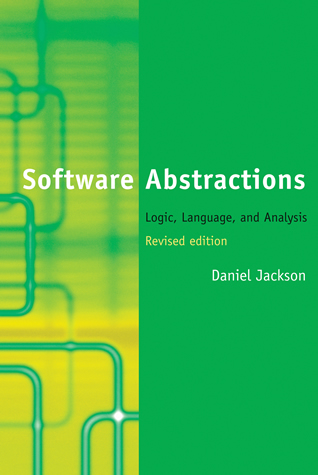
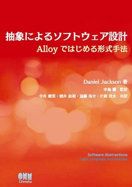

 

A revised edition of the book was published in November 2011 is now available from [MIT Press](http://mitpress.mit.edu/catalog/item/default.asp?ttype=2&tid=12880). There is a [Japanese translation](https://sites.google.com/site/softwareabstractionsja/) of the revised edition. The book has its own [website](http://softwareabstractions.org/) that includes sample chapters and downloadable models for all the examples in the book.

### reviews

“The examples and exercises, if given time, thought, and effort, can make better designers of all of us, as Alloy is a powerful force-multiplier in the war on bugs... Jackson’s Software Abstractions has my highest recommendation. It is being put to immediate use in my group’s venue of software-based safety-critical systems.”
—George Hacken, Computing Reviews

“Systems like Alloy should be in the toolbox of all software designers and developers, so such a comprehensive book on this topic is very welcome.”
—Anthony M. Sloane, Journal of Functional Programming

### endorsements, revised edition

“Those who have to learn and use the modern generation of formal methods—streamlined, lightweight, and highly automated—will welcome the appearance of the second edition of Daniel Jackson’s book on the Alloy language and its analyzer. Jackson’s writing, like his language design, is full of good taste, and he makes an intelligent and compelling argument for the construction of automated software abstractions as the central activity in software development. Every serious software engineer should read this book.”
—Jim Woodcock, University of York, UK

“In an area plagued by unnecessary complexity, Alloy shows there is still room for economy and elegance in software design. Readers of this book will enjoy a rare opportunity to learn how to write less in order to say more, without ambiguity. In short, to learn how to be productive.”
—José N. Oliveira, University of Minho

“Relational modeling is a powerful but subtle craft. This book applies the Alloy tool suite to pithy examples to educate everyone from working practitioners to researchers. Its joyful and informal tone mask the depth of accumulated wisdom in these pages.”
—Shriram Krishnamurthi, Brown University

### endorsements, first edition

“Abstraction is the essence of simple and effective software design, and logic is the essential tool for exploring and validating abstractions. These basic insights, which have been laboriously rediscovered by many practicing programmers, are now accessible to students and professionals at all levels of experience. Daniel Jackson supports his clear and elegant text with a powerful logical analysis tool that brings his witty examples to life.”
—Tony Hoare, Senior Researcher, Microsoft

“Alloy’s streamlined combination of predicate logic and relational algebra makes modeling a pleasure. I rely on the Alloy Analyzer, and this book shows how easy it is to start using it.”
—Pamela Zave, AT&T Research

“Alloy is to modeling what Excel is to office work: an incredibly powerful way to make models into concrete, tangible objects. Jackson’s book is essential for practitioners to master the power of this new tool.”
—Alain Wegmann, Ecole Polytechnique Fédérale de Lausanne

